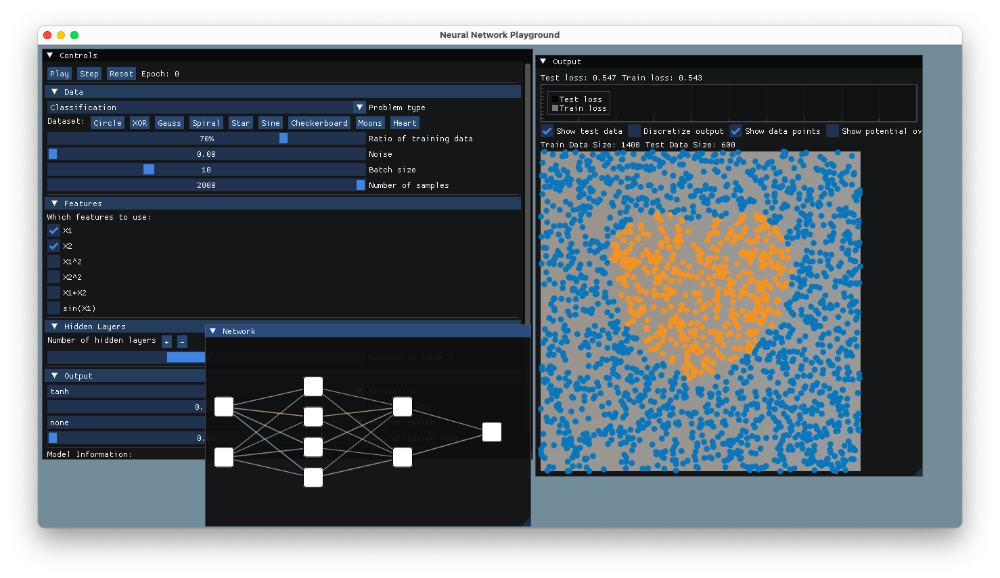
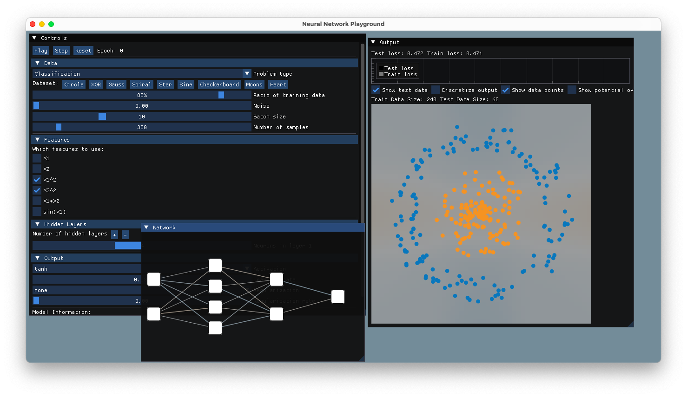
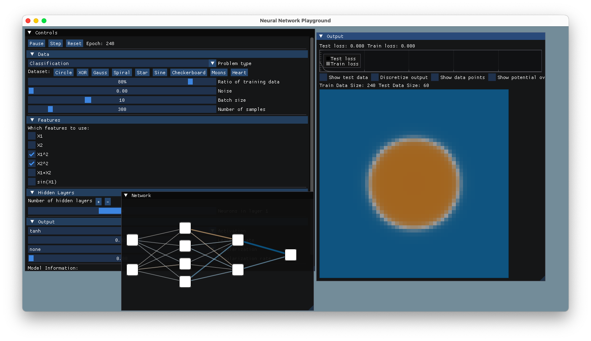
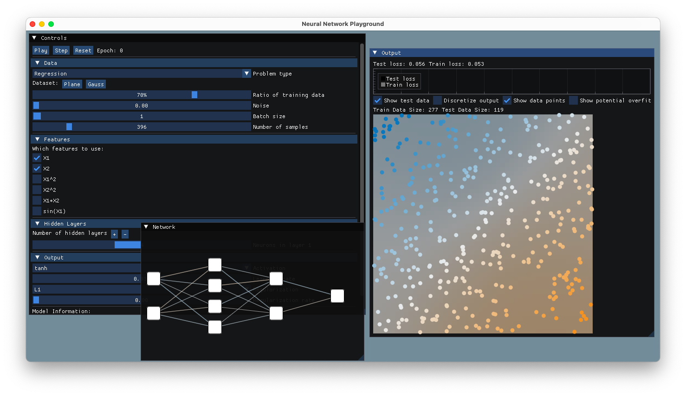
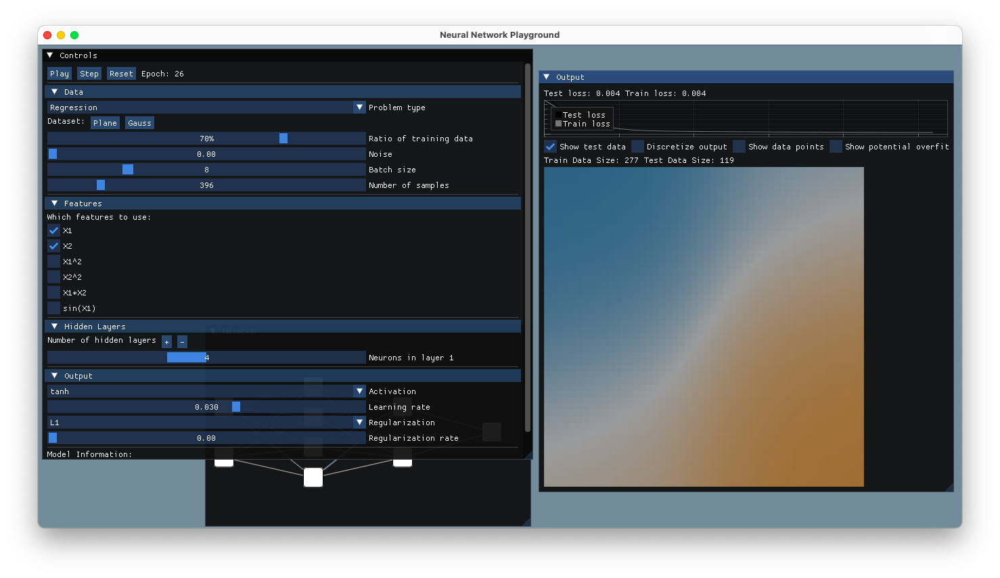

# Neural Network Playground

A Playground for Neural Networks, written in C++ , almost the same as the [Tensorflow](https://github.com/tensorflow/playground) one, maybe mine is worse :) as its a port.







## How to build

Make sure inside vendor folder you add
imgui and implot dependencies

### Build instructions on any *nix os

(tested on macOS Sequia, should work on Linux as well)

#### NOTE for Linux: modify my hacky cmake to build, glad path!

```bash
mkdir build
cd build
cmake ..
make
```
## Known Issues:

- Scaling
- Network Graph might display incorrect color activation between nodes (TODO)
- a lot more (probably).

## References:

- [Tensorflow Playground](https://github.com/tensorflow/playground)
