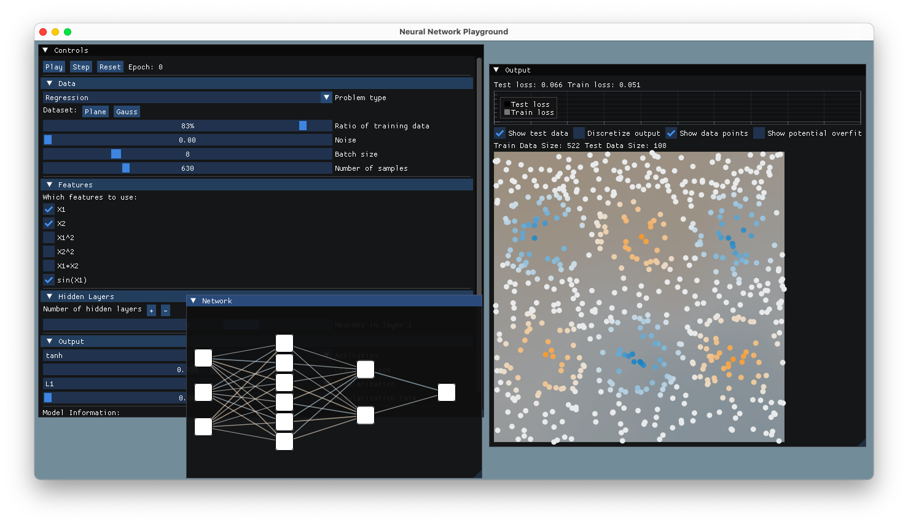
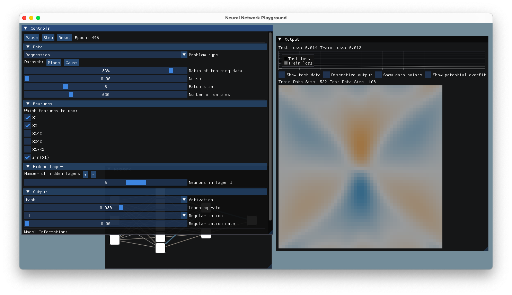

# Neural Network Playground

A Playground for Neural Networks I wrote during a recreational programming sesh,it is written in C++ , almost the same as the [Tensorflow](https://github.com/tensorflow/playground) implementation, maybe **mine** is worse :) as its a port, it probably has bugs so I wouldnt relly on it 100% for learning.

## Classification


## Regression

### Plane


### Gauss





## How to build

Make sure inside vendor folder you add
imgui and implot dependencies

### Build instructions on any *nix os

(tested on macOS Sequia, should work on Linux as well)

#### NOTE for Linux: modify my hacky cmake to build, glad path!

```bash
mkdir build
cd build
cmake ..
make
```
## Known Issues:

- Scaling
- Network Graph might display incorrect color activation between nodes (TODO)
- a lot more (probably).

## Goal of the project:
- What does "AI" want to "solve".
- How does a Neural Network "learn".

## References:

- [Tensorflow Playground](https://github.com/tensorflow/playground)
- [imgui](https://github.com/ocornut/imgui).
- [implot](https://github.com/epezent/implot).
- [glad](https://glad.dav1d.de/).
- [glfw](https://www.glfw.org/).
